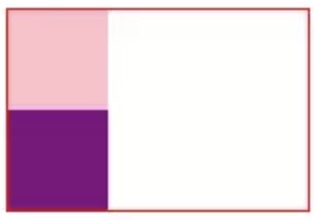
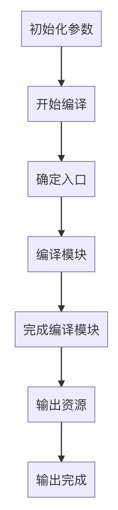
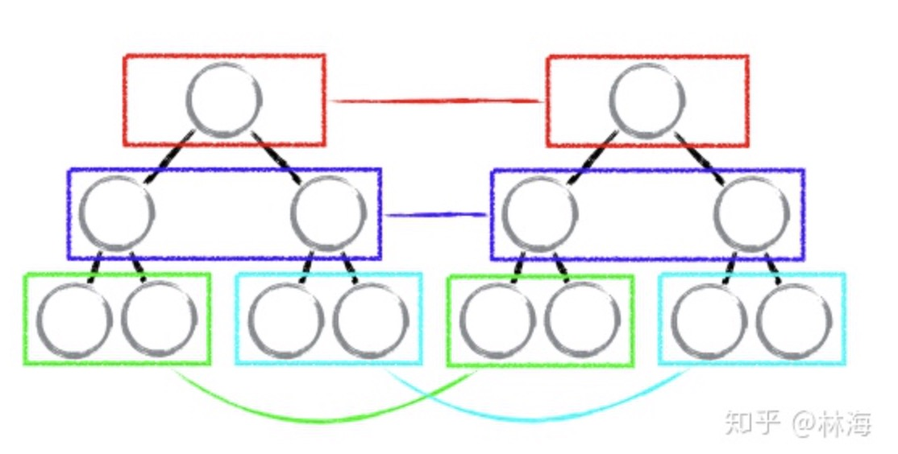
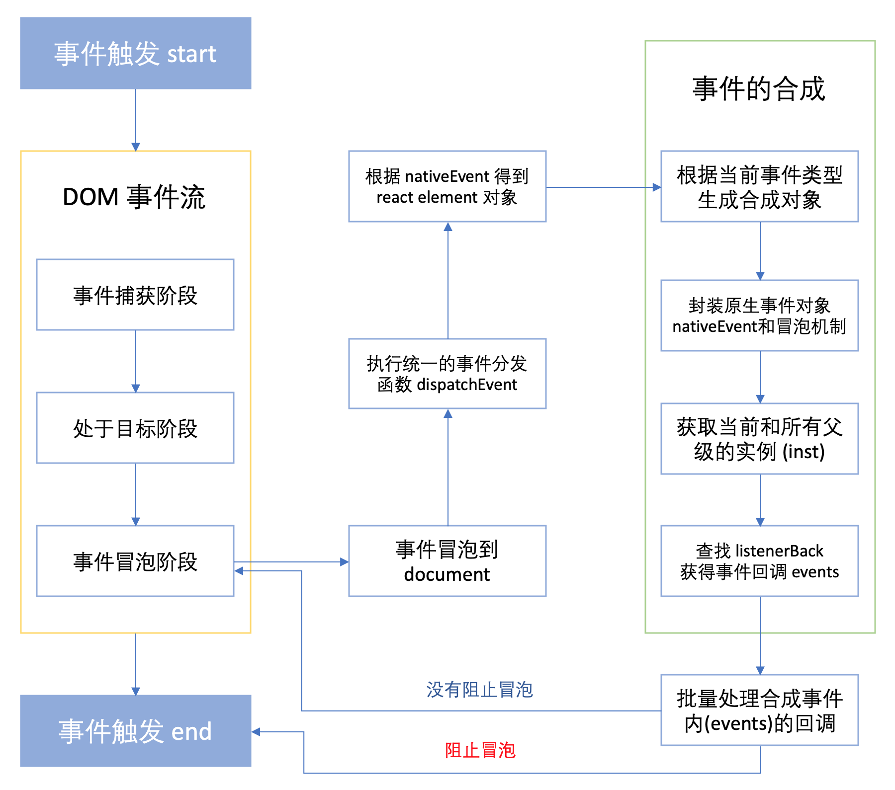
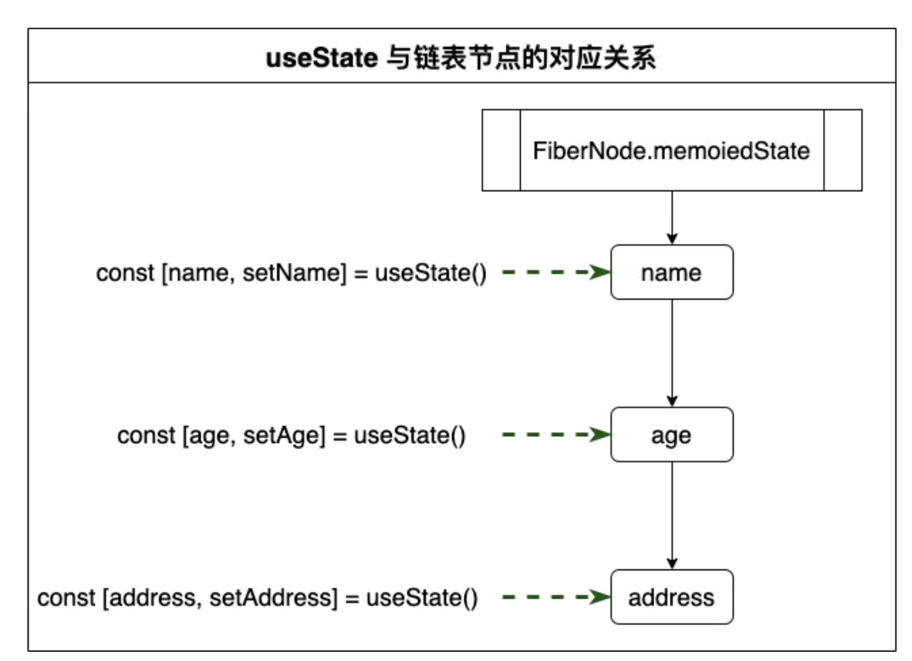
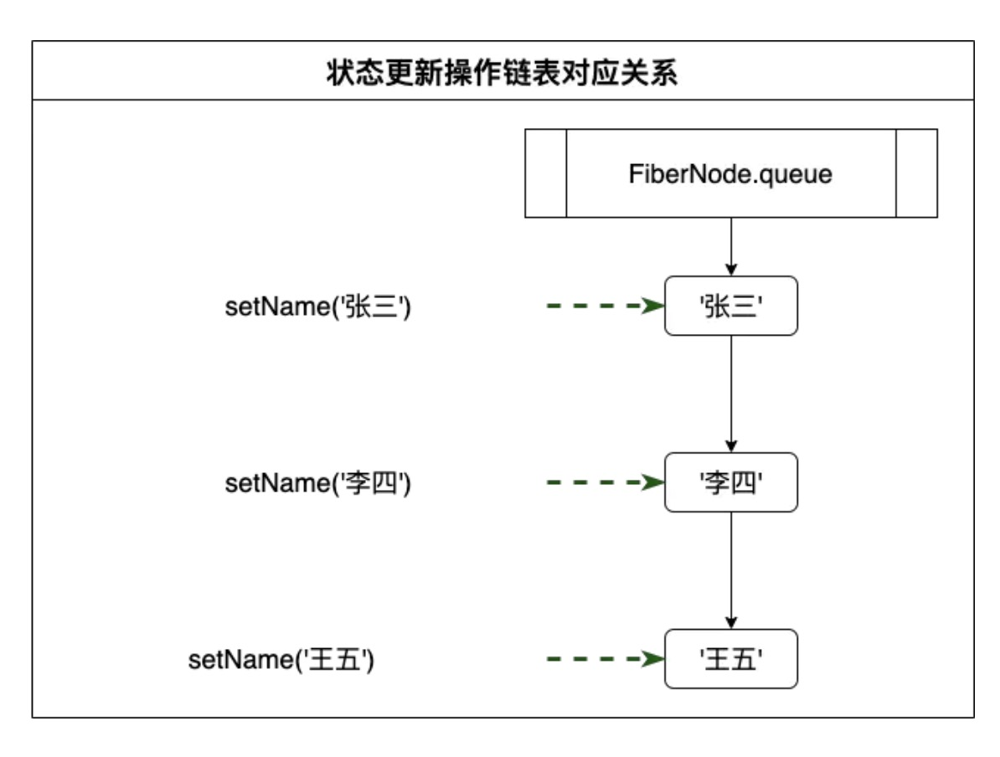

## 1.写 React / Vue 项目时为什么要在列表组件中写 key，其作用是什么？

 * 绑定key一定要唯一，这样在修改数据的时候才能驱动虚拟dom更新
 * 某些情况下不绑定key在修改数据后dom渲染的速度是比加key要快的(dom结构必须简单)，这种就是diff的<font color="red">就地复用</font>所以比加key要快
 * 一般是要加key，在vue里不加key只有黄字警告，但是在react的diff和vue的diff稍有区别，react循环渲染key是必须要加，不然在某一些情况下setState了数据视图没有更新

## 2.['1', '2', '3'].map(parseInt) 执行后是输出什么，为什么输出这个?

* map函数式回调形式返回参数一共有三个参数：value, index, array 当前值 当前下标 当前遍历的数组
* parentInt是内置函数一共有两个参数: string radix 需要转化成整形的值 需要返回的进制数

```js
  parseInt('1', 0); // 0 默认是10进制所以返回 1
  parseInt('2', 1); // 1 是1进制最大值为1 无法计算返回 NaN
  parseInt('3', 2); // 2 是2进制最大值为2 无法计算返回 NaN
```

* 所以答案是[1, NaN, NaN],不是['1', '2', '3']

## 3.什么是防抖和节流？有什么区别？如何实现？

* 防抖：动作绑定事件，动作发生后一定时间后触发事件，在这段时间内，如果该动作又发生，则重新等待一定时间再触发事件

```js
function debounce(fn, time) {
  let timer;
  return function() {
    clearTimeOut(timer);
    timer = setTimeOut(() => {
      fn.apply(this, arguments);
    }, time);
  }
}
```

* 节流: 动作绑定事件，在规定时间内不管事件怎么触发，事件始终执行一次

```js
function throtte(fn, time) {
  let activeTime = 0;
  return function() {
    const currentTime = Date.now();
    if (currentTime - activeTime > time) {
      fn.apply(this, arguments);
      activeTime = Date.now();
    }
  }
}
```

## 4.Set、Map、WeakSet 和 WeakMap 的区别？

* Set
  1. 成员不能重复
  2. 只有值，没有建名，类似数组
  3. 可以遍历，有add，delete，has, clear方法
* Map
  1. 是集合、字典可以储存不重复的值
  2. 集合石已[value1, value2]形式储存，字段是已[key, value]形式储存
* WeakSet
  1. 只能存储对象引用，不能存放值，Set是可以的
* WeakMap
  1. 是一种键值对的集合(null除外)，其中建是弱引用对象，而值可以是任意
  2. 不能遍历，有get, set, has, delete方法

## 5.深度优先遍历、广度优先遍历

* 深度优先遍历：假设某视图未被访问，则从某一个顶点v出发，依次访问下去直到访问不到为止，然后再访问另外一个未被访问的顶点v，依次执行下去。（其实就是多个tree递归的集合）

* 广度优先遍历：假设某视图未被访问，则从某一个顶点v出发访问完毕后再寻找另外一个顶点v直到找不到顶点v为止，然后在访问第一个访问过的顶点v的下级顶点，依次循环下去。(多个tree都先遍历顶部，遍历完所有tree的顶部，再遍历所有的下级，依次循环下去)

## 6.ES5/ES6 的继承除了写法以外还有什么区别？

* function声明变量会提升, class不会。

```js
const bar = new Bar(); // 这里不会报错，正常的new出来了
function Bar() {
  this.foo = 1;
}
```

```js
const bar = new Bar(); // bar is not defined;
class Bar {
  constructor() {
    this.foo = 1;
  }
}
```

* class声明会默认内部开启严格模式

* class所有方法都是不可枚举的

```js
function Bar() {
  this.foo = 1;
}
Bar.prototype.answer = function() {
  return 1314;
}
Object.keys(Bar.prototype) // ['answer']
```

```js
class Bar {
  constructor() {
    this.foo = 1;
  }
  static answer() {
    return 1314;
  }
}
Object.keys(Bar.prototype) // []
```

* class的所有方法没有原型prototype,不能用new调用

```js
function Bar() {
  this.foo = 1;
}
Bar.prototype.answer = function () {
  return 1314;
}
const bar = new Bar();
const answer = new bar.answer(); // 正常
```

```js
class Bar {
  constructor(){
    this.foo = 1;
  }
  answer() {
    return 1314;
  }
}
const bar = new Bar();
const answer = new bar.answer(); // 报错

```
* class使用前必须要new

* class内部不能重写类名

```js
function Bar() {
  Bar = 'Baz'; // 正常
  this.foo = 1;
}
```

```js
class Bar {
 constructor() {
   Bar = 'Baz'; // 报错
   this.foo = 1;
 }
}
Bar = 'Baz' // 正常
```

## 7.setTimeout、Promise、Async/Await 的区别

* 此题需要基础非常优秀，不然太容易混淆，我个人理解是宏观上的任务列队与微观任务列队的区别

* 例如经常会考的这样的题目问执行console的顺序

```js
console.log(1);
const promise = new Promise((resolve) => {
  console.log(2);
  resolve();
  console.log(3);
}).then(() => {
  console.log(4);
})
setTimeout(() => {
  console.log(5);
}, 0)
console.log(6)

/**
* 输出顺序 1 -> 2 -> 3 -> 6 -> 4 -> 5
**/
```

* 又例如关于async/await的

```js
async function function1() {
  console.log(2);
  await function2();
  console.log(3)
}
async function function2() {
  console.log(4);
}
console.log(1);
function1();
console.log(5);

/**
* 输出顺序 1 -> 2 -> 4 -> 5 -> 3
**/
```

* 4个混合使用 (头条面试题)

```js
async function async1() {
  console.log(1);
  await async2();
  console.log(2);
}

async function async2() {
  console.log(3);
}

console.log(4);

setTimeout(() =>{
  console.log(5)
}, 0);

async1();

new Promise((resolve) => {
  console.log(6);
  resolve();
}).then(() => {
  console.log(7);
});
console.log(8);

/**
* 输出顺序 4 -> 1 -> 3 -> 6 -> 8 -> 2 -> 7 -> 5
**/
```

* 在js中任务为同步任务和异步任务，不同任务在主线程上执行，而异步任务只要有了执行结果就会放入任务队列中，一旦主线程任务执行完，系统就会读取任务队列将异步任务添加到可执行任务队列中，开始执行。任务执行流程图如下:


* Promise异步是提现在then和catch的，所以在then之前的是同步执行的，await是等待而在任务队列里是让出一个线程的意思await后的同步任务会先执行，但是await的任务会在任务队列里去了

## 8.资源预加载，用于活动页面，游戏开始前加载

```js
/**
* 单张图片加载
* @param src
* @returns {Promise<any>}
*/
function loadImg(src='') {
  return new Promise((resolve, reject) => {
    const img = new Image();
    img.src = src;
    img.onload = () => {
      resolve(src)
    };
    img.onerror = () => {
      reject()
    }
  })
}
const imgArray = ['http://pic37.nipic.com/20140113/8800276_184927469000_2.png', 'http://pic25.nipic.com/20121205/10197997_003647426000_2.jpg', 'http://img.redocn.com/sheji/20141219/zhongguofengdaodeliyizhanbanzhijing_3744115.jpg', 'http://pic40.nipic.com/20140331/9469669_142840860000_2.jpg', 'http://pic39.nipic.com/20140321/18063302_210604412116_2.jpg'];
const imgLen = imgArray.length;
let loadSuccessCount = 0;
for (let i = 0; i < imgLen; i++) {
  loadImg(imgArray[i]).then(() => {
    loadSuccessCount++;
    console.log(`当前加载到${loadSuccessCount}张图片，当前进度${(loadSuccessCount / imgLen * 100).toFixed(2)}%`);
  });
}
```

## 9.算法题
> 已知如下数组: [ [1, 2, 2], [3, 4, 5, 5], [6, 7, 8, 9, [11, 12, [12, 13, [14] ] ] ], 10]; 编写一个函数把数组扁皮化，最终得到一个不重复且升序的数组;
```js
// 解法1 递归
function formatArray1(realArray) {
  let nowArr = [];
  function genArray(arr) {
    if (!Array.isArray(arr)) {
      nowArr.push(arr);
      return;
    }
    let len = arr.length;
    for (let i = 0; i < len; i++) {
      genArray(arr[i]);
    }
  }
  genArray(realArray);

  return Array.from(new Set(nowArr)).sort((a, b) => a - b);
}
// 解法2 es6
function formatArray2(realArray) {
  return Array.from(new Set(realArray.flat(Infinity))).sort((a, b) => a - b);
}
// 解法3 论坛上找的很秀
function formatArray3(realArray) {
  return realArray.toString().split(',').sort((a, b) => a - b).map(Number)
}
```

## 10.如何实现一个new方法
```js
function _new(fn, ...arg) {
  const obj = Object.create(fn.prototype);
  const ret = fn.apply(obj, arg);

  return ret instanceof Object ? ret : obj;
}
```

## 11.Vue 和 React 的主要生命周期

* Vue
  1. new Vue() 创建一个vue实例
  2. beforeCreate 实例创建前
  3. created 实例已被创建
  4. beforeMount 实例已创建渲染虚拟dom前
  5. mounted 虚拟dom渲染完毕
  6. beforeUpdate data数据变化更新前
  7. updated data数据变化更新完毕
  8. beforeDestory 实例销毁前
  9. destory 实例已销毁

* React
  1. getDefaultProps 载入默认的props
  2. getInitialState 载入state
  3. componentWillMount 虚拟dom渲染前
  4. render 渲染
  5. componentDidMount 虚拟dom渲染完毕
  6. props变化触发componentWillReceiveProps再触发shouldComponentUpdate
  7. setState触发shouldComponentUpdate
  8. shouldComponentUpdate返回true则触发componentWillUpdate -> render -> componentDidUpdate
  9. componentWillUnmount 组件销毁前

## 12.TCP 三次握手与四次握手
* 三次握手
  1. 你好我是A
  2. 收到，我是B
  3. 那么我们连接了
* 四次握手
  1. 你好我是A, 我要挂了
  2. 收到我是B, 请你等等我还有一些数据没有发给你
  3. 收到，我随时准备挂了
  4. 给你了，你可以挂了

## 13.React setState 笔试题，下面的代码输出什么？
```js
class Example extends React.Component {
    constructor() {
      super();
      this.state = {
        val: 0
      };
    }

    componentDidMount() {
      this.setState({val: this.state.val + 1});
      console.log(this.state.val);    // 第 1 次 log

      this.setState({val: this.state.val + 1});
      console.log(this.state.val);    // 第 2 次 log

      setTimeout(() => {
        this.setState({val: this.state.val + 1});
        console.log(this.state.val);  // 第 3 次 log

        this.setState({val: this.state.val + 1});
        console.log(this.state.val);  // 第 4 次 log
      }, 0);
    }

    render() {
      return null;
    }
  };

/**
* 输出顺序 0 -> 0 -> 2 -> 3
*/
```

* 当react在执行setState时候，有一个全局变量isBatchingUpdates，当是true的时候会把setState值缓存到dirtyComponents中，所以前2次打印状态没有改变打印结果为0

* 又因为state状态合并所以同步打次执行代码中对setState执行合并为一次

* 等同步代码执行完毕时候isBatchingUpdates会变为false，所以setState会按顺序执行

* 故是打印4次，render函数只触发3次

* 为何setTimeout中的setState无法合并,React更新是基于Transaction(事物)的，Transaction就是给目标执行函数包裹一下，打上前置后置的hook，在执行前执行initialize hook，结束后再执行close hook，这样搭配isBatchUpdates这样布尔标识就可以实现一整个函数调用栈内多次setState全部入pending队列，结束后统一apply了。setTimeout这样方法执行脱离了Transaction，react控制不到所以就没发batch了

## 14.重绘和回流，如何优化它们

* 浏览器渲染机制
  1. 浏览器是流式布局模型
  2. 浏览器会被html解析成dom，把css解析成cssom，dom和cssom组合形成了renderTree
  3. 有了renderTree就能遍历节点，计算它们在页面上的位置，最后绘制到页面上
  4. 在这种布局中，一般的dom遍历一次就能完成，但是table可能需要遍历多次, 所以table元素慎用
* 重绘：由于dom节点几何属性属性发生变化、由于样式发生变化而改变而不会影响布局的，称为重绘。重绘的代价是高昂的，因为浏览器必须验证dom树上的其他节点的可见性
* 回流: 布局、几何属性需要改变称为回流。回流是影响浏览器性能的关键元素，因为涉及到部分页面、整个页面的布局更新。一个dom元素的回流可能导致其他所有子元素以及其中紧随其后的节点、祖元素的随后回流。
* 回流必定会触发重绘，重绘不一定引发回流
* 以下属性改变会触发浏览器强制更新
  1. offsetTop、offsetLeft、offsetWidth、offsetHeight
  2. scrollTop、scrollLeft、scrollWidth、scrollHeight
  3. clientTop、clientLeft、clientWidth、clientHeight
  4. width、height
  5. getComputedStyle()
  6. getBoundingClientRect()
* 减少重绘与回流
  1. 使用 transform 替代 top
  2. 使用 visibility 替代 display: none
  3. table布局慎用
  4. 尽量在dom数的末端更改class，这样触发回流的dom能降到最少
  5. css选择器结构尽量简单，不要使用css表达式
  6. 动画效果运用在带有 position: absolute || fixed 时候可以使用requestAnimationFrame来执行动画
  7. 将频繁重绘或回流的节点设置成视图层，视图层能够阻止该节点渲染行为影响到别的节点。例如will-change、video、ifame等标签，浏览器自动视为视图层
  8. css3带有GPU的硬件加速，可以尽量使用css3替代以前的css
  9. 不要使用js频繁读取同一个dom，尽量用一个变量存储起来
  10. 对具有复杂动画的dom使用绝对定位，使它脱离文档流，否则会引起父元素的回流
  11. 频繁修改操作dom，创建一个documentFragment，最后在添加到文档上

## 15. Vuex、mobx、redux

* Vuex和redux思想是基本一致
  1. 统一维护应用状态
  2. 状态只有一个可信数据来源
  3. 操作更新方式同意，并且可控，通常以action方式提供更新状态途径
  4. Dispatcher接收所有的action，触发view
* mobx思想与上面两者就有区别了
  1. 他是面向对象的思想，而上面两种是面向函数的
  2. 没有时间回溯能力，因为数据只有一份引用
  3. 没有这样的烦恼，数据流动由函数调用一气呵成，便于调试
  4. 虽然他在报错的时候没有回溯，但是配合typescript一起使用则大大减少了报错的可能性, redux对typescript支持不太友好
  5. 它颗粒度较细，没有redux的中间件的思想，所以没有action分发，直接到view

## 16.什么是BFC,请解释一下它

  1. BFC是web里盒模型的css渲染模式，是指独立的一个渲染区或是一个独立的隔离独立容器
  2. B -> block、F -> formatting、C -> context
  3. 当display: block、list-item、table元素会产生bfc
  4. 什么情况下会触发BFC
    1. float且不为none
    2. position:absolute || fixed
    3. display: inline-block || table-cell || table-caption || flex || inline-flex
    4. overflow属性不为visible
  5. BFC元素的特点
    1. 盒子从顶端一个个排列
    2. 盒子的垂直方向由margin决定，同一个BFC的盒子margin会重叠
    3. 每个盒子左边边缘会碰到父元素，父元素的border在padding和margin都为0时，会重叠
    4. 如果父元素没有设定高度，但盒子里有子盒子有浮动元素，那么BFC在计算高度时候，会算上子盒子浮动的高度

```html
<style>
.father {
    width: 150px;
    border: 1px solid red;
}

.son1, .son2 {
    width: 50px;
    height: 50px;
    background-color: pink;
}

.son2 {
    background-color: purple;
}
</style>
<div class="father">
     <div class="son1"></div>
     <div class="son2"></div>
</div>
```

正常情况下的样子是上下块撑开父元素的高度



当给两个子元素设置了float属性之后，子元素不再占据父元素的空间，此时父元素的高度就为0


当设置父元素bfc后，此时就清除了子元素浮动带来的影响，什么影响呢，就是不撑开父元素的高度的影响，那么父元素的高度就是子元素的高度为父元素添加overflow:hidden;


## 17.介绍下观察者模式和订阅-发布模式的区别，各自适用于什么场景

* 观察模式：一个被观察的对象的状态发现变化，则会通知所有依赖它的对象

  例子：去餐厅吃饭时候，经常遇到人很多的情况，餐厅会给你发一个号码让你排队，餐厅则被视为观察者，一旦餐厅有位置了，则会通知所有排队的客人。

```js
class Subject {
  constructor() {
    this.observers = [];
  }

  addObserver = (obj) => this.observers.push(obj);

  notify = () => {
    for (let obj of this.observers) {
      if (obj.update && typeof obj.update === 'function') {
        obj.update();
      }
    }
  }
}
const subject = new Subject();
const subA = {
  update: () => {
    console.log('update subA')
  }
};
const subB = {
  update: () => {
    console.log('update subB')
  }
};
// 添加观察者
subject.addObserver(subA);
subject.addObserver(subB);
// 通知所有观察者
subject.notify();
```

* 发布模式：发布者状态更新时，发布某些类型的通知，只通知订阅了相关类型的订阅者，发布者和订阅者是没有直接关联的

  例子：去餐厅吃饭时候，经常遇到人很多的情况，餐厅会给你发一个号码让你排队(订阅了)，我们在排队过程中干其他的事情去了，到我们的号码的时候餐厅则会通知我们去就餐

```js
class Publish {
  constructor() {
    this.topics = {};
  }

  subscribe = (type, fn) => { // 订阅
    if (!this.topics[type]) {
      this.topics[type] = [];
    }
    this.topics[type].push(fn);
  };

  doPublish = (type, ...args) => { // 发布指定类型的主题
    if(!this.topics[type]) {
      return;
    }
    for (let fn of this.topics[type]) {
      fn(args);
    }
  };
}
const publish = new Publish();
const subA = {type: 'typeA'};
const subB = {type: 'typeB'};
const subC = {type: 'typeC'};
// 订阅
publish.subscribe(subA.type, () => console.log(`subscribe ${subA.type}`));
publish.subscribe(subB.type, () => console.log(`subscribe ${subB.type}`));
publish.subscribe(subC.type, () => console.log(`subscribe ${subC.type}`));
// 发布通知
publish.doPublish(subA.type);
```

## 18.算法题

> 请把两个数组 ['A1', 'A2', 'B1', 'B2', 'C1', 'C2', 'D1', 'D2'] 和 ['A', 'B', 'C', 'D']，合并为 ['A1', 'A2', 'A', 'B1', 'B2', 'B', 'C1', 'C2', 'C', 'D1', 'D2', 'D']

```js
function formatArray(arr1, arr2) {
  let formatArr2 = arr2.map(v => v + 3);
  let arr = [];

  arr1.concat(formatArr2).sort().map(v => {
    if (v.indexOf('3') !== -1) {
      v = v.split('')[0]
    }
    arr.push(v);
  });

  return arr;
}
```

## 19. 改造下面的代码，使之输出0 - 9，写出你能想到的所有解法。

```js
for (var i = 0; i< 10; i++){
  	setTimeout(() => {
  		console.log(i);
      }, 1000)
  }
```

```js
for (let i = 0; i < 10; i++) {
	setTimeout(() => {
  		console.log(i);
    }, 1000)
}
```

```js
for (var i = 0; i < 10; i++) {
  ((i) => {
    setTimeout(() => console.log(i), 1000)
  })(i)
}
```

```js
for (var i = 0; i < 10; i++) {
  setTimeout(i => {
    console.log(i)
  }, 1000, i);
}
```

## 20.实现一个sleep函数

```js
function sleep(time) {
  return new Promise((resolve) => {
    setTimeout(() => {
      resolve()
    }, time)
  })
}
```

## 21.实现 (5).add(3).minus(2) 功能

```js
Number.prototype.add = function(num) {
  if (typeof num !== 'number' || isNaN(num)) {
    throw new Error(`must be num number`);
  }

  return this + num;
};

Number.prototype.minus = function(num) {
  if (typeof num !== 'number' || isNaN(num)) {
      throw new Error(`must be num number`);
  }

  return this - n;
};
```

## 22.冒泡排序如何实现，时间复杂度是多少， 还可以如何改进？

```js
// 原始冒泡 O(n^2)
function buddleSort(arr) {
  const array = arr;
  const len = array.length;
  for (let i = 0; i < len - 1; i++) {
    for (let j = 0; j < i + 1; j++) {
      if (array[i] > array[j]) {
        let temp = array[i];
        array[i] = array[j];
        array[j] = temp;
      }
    }
  }

  return array;
}

// 优化版本
function buddleSort1(arr) {
  const array = arr;
  const len = array.length;
  let isSort = true;

  for (let i = 0; i < len - 1; i++) {
    for (let j = 0; j < i + 1; j++) {
      if (array[i] > array[j]) {
        let temp = array[i];
        array[i] = array[j];
        array[j] = temp;

        isSort = false;
      }
    }
    if (isSort) {
      break;
    }
  }

  return array;
}
```

## 23.某公司 1 到 12 月份的销售额存在一个对象里面

> 如下：{1:222, 2:123, 5:888}，请把数据处理为如下结构：[222, 123, null, null, 888, null, null, null, null, null, null, null]。

```js
function format(obj) {
  return Array.from({ length: 12 }).map((item, index) => obj[i + 1] || null);
}
```

## 24.要求设计 LazyMan 类，实现以下功能

LazyMan('Tony');

> // Hi I am Tony

LazyMan('Tony').sleep(10).eat('lunch');

> // Hi I am Tony

> // 等待了10秒...

> // I am eating lunch

LazyMan('Tony').eat('lunch').sleep(10).eat('dinner');

> // Hi I am Tony

> // I am eating lunch

> // 等待了10秒...

> // I am eating diner

LazyMan('Tony').eat('lunch').eat('dinner').sleepFirst(5).sleep(10).eat('junk food');

>  // Hi I am Tony

>  // 等待了5秒...

>  // I am eating lunch

>  // I am eating dinner

>  // 等待了10秒...

>  // I am eating junk food
```js
  class LazyMan {
    constructor(name) {
      console.log(`Hi I am ${name}`);
      this.taskList = [];
      this.name = name;

      setTimeout(() => this.next(), 0)
    }

    eat = (food) => {
      let that = this;
      const fn = (function (f) {
        return () => {
          that.next();
          console.log(`I am eating ${f}`)
        }
      })(food);
      this.taskList.push(fn);
      return this;
    };

    sleepFirst = (time) => {
      let that = this;
      const fn = (function (t) {
        return () => {
          setTimeout(() => {
            console.log(`等待了${t}秒...`);
            that.next();
          }, time * 1000);
        }
      })(time);
      this.taskList.unshift(fn);
      return this;
    };

    sleep = (time) => {
      let that = this;
      const fn = (function (t) {
        return () => {
          setTimeout(() => {
            console.log(`等待了${t}秒...`);
            that.next();
          }, time * 1000);
        }
      })(time);
      this.taskList.push(fn);
      return this;
    };

    next = () => {
      let fn = this.taskList.shift();
      fn && fn();
    }
  }

  function lazyMan(name) {
    return new LazyMan(name);
  }
  lazyMan('哈哈哈').sleepFirst(5).eat('水果').sleep(10);
```

## 25.输出以下代码运行结果

```js
// example 1
var a={}, b='123', c=123;
a[b]='b';
a[c]='c';
console.log(a[b]);
```

```js
// example 2
var a={}, b=Symbol('123'), c=Symbol('123');
a[b]='b';
a[c]='c';
console.log(a[b]);
```

```js
// example 3
var a={}, b={key:'123'}, c={key:'456'};
a[b]='b';
a[c]='c';
console.log(a[b]);
```

* 对象的建必须是字符串或symbol
* 第一题输出是c，a[c]隐式转换把123转换成了'123'，所以会覆盖a[b]故输出c
* 第二题输出b，因为是用symbol定义的
* 第三题输出c，b和c是对象隐式转换成了'[object object]'，所以会覆盖a[b]故输出c

## 26.手写Promise

```js
// https://github.com/M-FE/js-functions-simulation/blob/master/src/promise.ts
class _Promise {
  constructor(fn) {
    this.PENDING = 'PENDING';
    this.FULFILLED = 'FULFILLED';
    this.REJECTED = 'REJECTED';

    this.status = this.PENDING;
    this.value = undefined;
    this.reason = [];
    this.callbacks = [];
    this.executed = false;

    try {
      fn(this._resolve, this._reject);
    } catch (e) {
      this._reject(e);
    }
  }

  _resolve = (value) => {
    if (this.executed) {
      return;
    }
    this.executed = true;

    if (this._promiseLike(value)) {
      value.then(this._resolve, _this.reject);
      return;
    }

    this.value = value;
    this.status = this.FULFILLED;
    this.callbacks.forEach(callback => this._handler(callback));
  }

  _reject = (reason) => {
    if (this.executed) {
      return;
    }
    this.executed = true;
    if (this._promiseLike(reason)) {
      reason.then(this._resolve, this._reject);
      return;
    }

    this.reason = reason;
    this.status = this.REJECTED;
    this.callbacks.forEach(callback => this._handler(callback));
  }

  _handler = (callback) => {
    if (this.status === this.PENDING) {
      this.callbacks.push(callback);
      return;
    }
    const { onFulfilled, onRejected, nextResolve, nextReject } = callback;

    if (this.status === this.FULFILLED) {
      const nextValue = onFulfilled ? onFulfilled(this.value) : this.value;
      nextResolve(nextValue);
      return;
    }

    if (this.status === this.REJECTED) {
      const nextReason = onRejected ? onRejected(this.reason) : this.reason;
      nextReject(nextReason);
    }
  }

  _promiseLike = (data) => {
    return data instanceof _Promise || (['function', 'object'].indexOf(typeof data) > -1 && 'then' in data);
  }

  resolve = (value) => {
    if (this._promiseLike(value)) {
      return value;
    }
    return new _Promise((resolve) => resolve(value));
  }

  reject = (reason) => {
    if (this._promiseLike(reason)) {
      return reason;
    }
    return new _Promise((resolve, reject) => reject(reason));
  }

  then = (onFulfilled, onRejected) => {
    return new _Promise((nextResolve, nextReject) => {
      this._handler({
        onFulfilled,
        onRejected,
        nextResolve,
        nextReject,
      })
    })
  }

  catch = (onRejected) => {
    return this.then(undefined, onRejected);
  }
}
```

## 26.call,apply,bind的区别如何实现它们

* call方法第一个参数是要绑定this的值，后面传入是一个参数列表。当地一个参数为null,undefined时候默认指向window

```js
// 一个简单的使用例子
const obj = {
  message: 'My name is:'
};
function getName(firstName, lastName) {
  console.log(`${this.message}${firstName}-${lastName}`);
}
getName.call(obj, '张三', '李四');

// 实现一个call
Function.prototype._call = function(context) {
  if (typeof this !== 'function') {
    throw new TypeError('not funciton')
  }

  const ctx = context || window; // 若给null undefined则指向window

  ctx.fn = this; // 重新绑定this

  const args = [...arguments].slice(1); // 获取方法里传递的所有参数,第0个除外

  const res = ctx.fn(...args);

  // 删除改方法，不然会污染被调用的对象
  delete ctx.fn;

  return res;
}
```

* apply接收两个参数，第一个参数是给绑定给this的值，第二个参数是一个参数数组。当第一个参数为null,undefined时候则默认指向window

```js
// 使用例子
const obj = {
  message: 'My name is:'
};
function getName(firstName, lastName) {
  console.log(`${this.message}${firstName}-${lastName}`);
}
getName.apply(obj, ['张三', '李四']); // 其实apply和call最后目标是一直，只是后面参数传递方式的区别，apply是数组

// 实现一个apply
Function.prototype._apply = function(context) {
  if (typeof this !== 'function') {
    throw new TypeError('not funciton')
  }

  const ctx = context || window;

  ctx.fn = this;

  const res = arguments[1] ? ctx.fn(arguments[1]) : ctx.fn();

  delete ctx.fn;

  return res;
}
```

* bind和call非常相似，第一个参数是this指向，从第二个参数开始接受的参数列表。区别在与bind方法返回值是函数以及bind接受到的参数列表，bind方法不会立刻执行，而是返回了一个改变上下文this的函数，原函数不变化

```js
// 使用例子
const obj = {
    message: 'My name is:'
};
function getName(firstName, lastName) {
  console.log(`${this.message}${firstName}-${lastName}`);
}
const fn = getName.bind(obj, '张三', '李四');
fn();

// 实现一个bind
Function.prototype._bind = function(context) {
  if (typeof this !== 'function') {
    throw new TypeError('not funciton')
  }

  let that = this;
  let args = [...arguments].slice(1);

  return function _F() {
    if (this instanceof _F) {   // 处理函数使用new的情况
      return new that(...args, ...arguments)
    } else {
      return that.apply(context, [...args, ...arguments])
    }
  }
}
```

## 27.关于对象拷贝
```js
// 实现浅拷贝
function copyObj(obj) {
  if (!obj) {
    return obj;
  }
  return Object.assign({}, obj);
}

function deepCopy(obj) {
  if (!obj || typeof obj === 'string') {
    return obj
  }
  let target = obj instanceof Array ? [] : {};
  for (let key in obj) {
    target[key] = typeof obj[key] === 'object' ? deepCopy(obj[key]) : obj[key];
  }
  return target;
}
```
## 28.实现一个EventEmitter
```js
class EventEmitter {
  constructor() {
    this.events = this.events || new Map()
  }
  // 添加监听
  addListener(type, fn) {
    if (!this.events.get(type)) {
      this.events.set(type, fn);
    }
  }
  // 接收监听
  emit(type) {
    const handle = this.events.get(type);
    handle.apply(this, [...arguments].splice(1))
  }
  // 移除监听
  removeListener(type) {
    this.events.delete(type)
  }
}
```

## 29.react hook
```js
import React, { useState } from 'react'

/**
* 随机颜色函数
* @param colors
* @param initialColor
* @returns {*[]}
*/
const useRandomColor = (colors=[], initialColor='#fff') => {
  const lenColor = colors.length;
  const [color, setColor] = useState(initialColor);

  const changeColor = () => {
    const index = Math.floor(Math.random() * lenColor);
    const activeColor = colors[index];
    setColor(activeColor);
  };

  return [color, changeColor]
};

const colorBanner = () => {
  const colors = ['red', 'blue', 'green'];
  const [color, changeColor] = useRandomColor(colors, 'red');

  return(
     <div style={{ textAlign: 'center', padding: '20px 0', backgroundColor: color }}>
       <h2>点击更换背景色</h2>
       <br />
       <button onClick={changeColor}>change</button>
     </div>
  )
};
```

## 30.最简洁方法实现m的n次方结果

```js
/**
* @param {number} number     被次方数
* @param {number} powNumber  次方数
*/
const mathPow = (number, powNumber) => number ** powNumber
```

## 31.写一个 mySetInterVal(fn, a, b),每次间隔 a,a+b,a+2b, ...a + nb 的时间，然后写一个 myClear，停止上面的 mySetInterVal

```js
function LoopFn(fn, a, b) {
  this.a = a;
  this.b = b;
  this.deepCount = 0;
  this.timer = null;

  this.doFn = () => {
    this.timer = setTimeout(() => {
      fn();
      this.deepCount++;
      this.doFn();
    }, this.a + (this.b * this.deepCount));
  };

  this.clear = () => {
    if (this.timer) {
      clearTimeout(this.timer);
      this.timer = null;
      this.deepCount = 0;
    }
  };
}

var loopFn = null;
function mySetInterVal(fn, a, b) {
  loopFn = new LoopFn(fn, a, b);
  loopFn.doFn();
}

function myClear() {
  if (loopFn) {
    loopFn.clear();
    loopFn = null;
  }
}
```

## 32.合并二维有序数组成一维有序数组，归并排序的思路

```js
function mergeSortArr(arr) {
  let mergeArr = arr.toString().split(',').map(v => v * 1);
  return mergeArr.sort((a, b) => a - b);
}
```

## 33.斐波那契数列

```js
function fb(n) {
  if (n <= 0) {
    throw new Error('长度不能小于0')
  }
  if (n < 2) {
    return n;
  }
  let arr = [];
  arr[0] = 0;
  arr[1] = 1;
  for (let i = 1; i < n; i++) {
    arr[i + 1] = arr[i] + arr[i - 1];
  }
  return arr;
}
```

## 34.React 项目中有哪些细节可以优化？实际开发中都做过哪些性能优化

* 父级改变props后导致子组件里的嵌套的子组件收到影响也触发render导致性能问题，可使用PureComponent或者hook的React.memo进行组件优化，若需要深度优化可以使用react生命周期里的ShouldComponentUpdate进行部分字段return false 优化

* 尽量不要使用index当key导致diff算法失效

* 减少标签树层级，可使用数组组件或Fragments

* 使用redux或mobx这种状态库更新数据时候尽量不要全局更新导致多处组件触发render可使用immediate-helper库进行数据更新

* 不要在render函数中处理数据

## 35.实现add(1)(2)(3)

```js
//简单版
function add1(a) {
  return function(b) {
    return function(c) {
      return a + b + c
    }
  }
}
// 函数柯里化
function getTotal(...args) {
  return args.reduce((a, b) => a + b);
}

function curry(fn) {
  let argsArr = [];
  return function temp(...tempArgs) {
    if (tempArgs.length > 0) {
      argsArr = [...argsArr, ...tempArgs];
      return temp;
    } else {
      let val = fn.apply(this, argsArr)
      argsArr = [];
      return val;
    }
  }
}

let add2 = curry(getTotal);
console.log(add2(1)(2)(3)());
console.log(add2(2,3)(4,5)(6)())
```

## 36.实现事件订阅发布

```js
class EventBus {
  constructor() {
    Object.defineProperty(this, 'handles', {
      value: {}
    })
  }

  on = (eventName, listener) => {
    if (typeof listener !== 'function') {
      throw new Error('listener must be function!')
    }
    if (!this.handles[eventName]) {
      this.handles[eventName] = [];
    }
    this.handles[eventName].push(listener)
  }

  emit = (eventName, ...args) => {
    let listeners = this.handles[eventName]
    if (!listeners) {
      throw new Error(`${eventName} must be null`);
    }
    for (listener of listeners) {
      listener(...args);
    }
  }

  off = (eventName, listener) => {
    if (!listener) {
      delete this.handles[eventName];
      return;
    }
    let listeners = this.handles[eventName];
    if (listeners && listeners.length > 0) {
      const index = listeners.findIndex(item => item === listener);
      listeners.splice(index, 1);
    }
  };

  once = (eventName, listener) => {
    if (typeof listener !== 'function') {
      throw new Error('listener must be function!')
    }
    const onceListener = (...args) => {
      listener(...args);
      this.off(eventName, listener);
    };
    this.on(eventName, onceListener);
  };
}
```

## 37.实现Math.sqrt开平方根函数

```js
// 使用牛顿迭代法开平方根即公式是 x = (x + n / x) / 2
function _sqrt(n) {
  if (isNaN(n)) {
    throw new Error('must be NaN');
  }
  if (n < 0) {
    throw new Error('must be < 0');
  }
  let val = n,last;
  do {
    last = val;
    val = (val + n / val) / 2;
  }
  while (Math.abs(val - last) >= Math.pow(2, -52));
  return val;
}
```

## 38.实现图片懒加载

```js
function getWindowHeight() {
  return window.innerHeight ||
    document.documentElement.clientHeight ||
    document.body.clientHeight;
}

function getTop(dom) {
  let offsetTop = dom.offsetTop;
  while(dom = dom.offsetParent) {
    offsetTop += dom.offsetTop;
  }
  return offsetTop;
}

let count = 0;
function lazyLoad(imgs) {
  const delta = 30;
  const winH = getWindowHeight();
  const scrollTop = document.documentElement.scrollTop ||
    document.body.scrollTop;
  for (let i = 0; i < imgs.length; i++) {
    if (winH + scrollTop + delta > (getTop(imgs[i]) && getTop(imgs[i]) + imgs[i].offsetHeight + delta > scrollTop)) {
      if (!imgs[i].src) {
        imgs[i].src = imgs[i].getAttribute('data-src');
        count++;
      }
      if (count === imgs.length) {
        window.removeEventListener('scroll', handler);
        window.removeEventListener('load', handler);
      }
    }
  }
}

function handler() {
  lazyLoad(document.getElementsByTagName('img'));
}
window.removeEventListener('scroll', handler);
window.removeEventListener('load', handler);
```

## 39.在浏览器输入url到页面渲染完毕发生了什么

### 完整版

* 查看硬盘hosts文件是否有对应域名隐射，如果有则直接返回

* 根据输入域名向DNS查询IP地址

* 得到地址后，建立连接，进行三次握手
  1.客户端：我要连接你了可以吗？
  2.服务端：嗯，我准备好，连接我吧。
  3.客户端：那我连接你咯。

* 向该IP地址发送一个GET请求，服务器80端口会做出响应

* 服务器在80端口请求，传递相应内容到浏览器

* 浏览器根据返回内容进行解析，并继续搜索页面是否有请求，有的话继续通过IP地址发送到服务器

* 接收完从服务器至浏览器的内容后，浏览器渲染页面，把内容呈现出来

* 客户端和服务端断开连接，进行第四次挥手

### 简单版

* DNS解析

* TCP连接

* 发送HTTP请求

* 服务器处理请求并返回HTTP报文

* 浏览器解析内容渲染页面

* 连接结束

## 40.性能优化

* 使用打包工具压缩代码

* 雪碧图,图片懒加载

* 图片cdn

* js gzip

* 使用服务器渲染(SSR)

* 非必要执行的js文件可以标签加上async或defer来延迟加载

* 骨架屏

* 减少dom操作

* css选择器复杂性降低

* dom结构复杂性降低

## 41.Vue中computed和methods区别

* computed内部变量不会发生变化的时候都只会执行一次，会有缓存。methods每次调用都会执行没有缓存

* computed是响应式的，methods不是

* 调用方式不一样，computed定义成员像属性一样访问，methods定义成员必须函数形式调用

* computed中成员可以只定义个函数作为制度属性，也可以定义set get变成可读写属性，这点methods不行

## 42.获取url中的参数，1. 指定参数名称，返回该参数的值 或者 空字符串，2. 不指定参数名称，返回全部的参数对象 或者 {}，3. 如果存在多个同名参数，则返回数组

```js
function getUrlParam(sUrl, sKey) {
  if (!sUrl || sUrl.indexOf('?') === -1) {
    return "";
  }
  let params = {};
  let paramsArr = sUrl.indexOf('#') > -1 ?
    sUrl.split('?')[1].split('#')[0].split('&') :
    sUrl.split('?')[1].split('&');

  for (let i = 0; i < paramsArr.length; i++) {
    let key = paramsArr[i].split('=')[0];
    let val = decodeURIComponent(paramsArr[i].split('=')[1]);
    if (ket in params) {
      params[key] = [].concat(params[key], val);
    } else {
      params[key] = val;
    }
  }

  return sKey ? params[sKey] || "" : params;
}
```

## 43.webpack原理

### 基本概念

* entry 入口文件

* module 模块，在webpack中一个模块对应一个文件。webpack会从entry开始，递归找出所有依赖模块

* chunk 代码块，一个chunk由多个模块组成，用于代码合并与分割

* loader 模块转换器，用于将模块原内容按照要求转换成新内容

* plugin 拓展插件，在webpack构建流程中特定实际会广播时间，插件可以监听这些事件，用于开发一些定制化编译

### webpack从启动到结束一次执行顺序下



* 初始化参数：从配置文件（默认webpack.config.js）和shell语句中读取合并参数，得出最终参数

* 开始编译：用上一步的配置参数初始化Comiler对象，加载所有配置插件，通过执行run方法开始编译

* 确定入口：根据配置中entry找出所有入口文件

* 编译模块：从入口文件出发，调用所有配置的loader对模块进行翻译，再找出改模块依赖的模块，再递归本步骤进行翻译

* 完成编译模块：经过上一步后，得到了每个模块被翻译后的最终内容和之间的依赖关系

* 输出资源：根据入口和模块执行依赖关系，组成一个个包含多个模块chunk，再将每个chunk转换成单独的文件加入输出列表中，这是可以修改内容的最后机会

* 输出完成：在确定好输出内容，根据配置（webpack.config.js && shell）确定出书的路径和文件名，将文件的内容写入文件系统中（nodejs fs模块进行）

* 在上述过程中，webpack会在特定的时间广播特定事件，插件监听事件并执行相应的逻辑，并且插件可以调用webpack提供的api改变webpack的运行结果

## 44.css各种选择器的权重

* 内联(1000) > ID(0100) > class(0010) > 标签(0001) > 通配符、子选择器、等(0000)

## 45.css盒模型

* w3c盒模型包含margin、border、padding、content,并且content不包涵其他部分(box-sizing:content-box)

* ie盒模型包含margin、border、padding、content,并且content包含了padding和border (box-sizing:border-box)

## 46.浏览器缓存机制，强缓存，协商缓存，http头字段

### 浏览器缓存机制

* 浏览器发起HTTP请求 - 服务器响应请求。浏览器第一次向服务器发起请求结果后拿到请求结果，会根据响应报文中HTTP头的缓存标识，决定是否缓存，若是则将请求结果缓存到浏览器中

### 强缓存

* 向浏览器缓存查找请求结果，并根据该结果的缓存规则来决定是否使用缓存结果过程

* 强制缓存失效，则直接想服务器发起请求

* 存在缓存标识，但是结果已失效，则使用协商缓存

* 存在缓存标识，结果还没有失效，则生效，直接返回结果（典型就是ie浏览器的get请求请求标头的Expires和Cache-Control,后者比前者高）

### 协商缓存

* 协商缓存就是强制缓存失效后，浏览器携带缓存标识向服务器发起请求，有由服务根据协商缓存标头是否使用缓存的过程

* 协商缓存生效则http code返回304

* 协商缓存失败则http code返回200

* 协商缓存标头Last-Modified / If-Modified-Since和Etag / If-None-Match, 其中Etag / If-None-Match的优先级比Last-Modified / If-Modified-Since高

## 47.JavaScript作用域

* 局部作用域

* 全局作用域

* 白话说就是里面能访问外面，外面不能访问到里面

## 48.new一个对象的过程

* 创建一个新对象

* 将构造函数的作用域值赋值给新对象

* 执行构造函数中的代码

* 返回新对象

```js
function _new(constructor, ...args) {
  let obj = {};
  obj.__proto__ = constructor.prototype;
  let result = constructor.apply(obj, arg);

  return Object.prototype.toString.call(result === '[object object]' ? result : obj);
}
```

## 49.简单说明下什么是事件冒泡，事件委托，事件捕获

### 事件冒泡

* 事件按照特定的事件目标到最不特定的事件目标的顺序触发，当一个元素接收到事件的时候会把它接收到的事件传给自己的父级一直到window结束(事件向上传播)

### 事件委托

* 事件委托是利用事件冒泡的，只制定一个时间处理程序，可以管理某一类所有事件

### 事件捕获

* 事件最不准确的对象开发触发，然后到最精确(与事件冒泡相反，向下传播)

## 50.从prototype、隐式__proto__、constructor再到修改原型链内容导致的影响

* 修改构造函数的原型，影响已创建的实例

```js
Foo.prototype.name = 'hello';
```

* 修改构造函数(涉及this)，影响后来创建的实例

```js
Foo() {
  this.name = 'hello';
}
```

* 修改构造函数(不涉及this)，无影响

```js
Foo.name = 'hello';
```

## 51.如何实现闭包

* 优点：内部可以访问全局变量，内部变量私有，且执行后不会被垃圾回收

* 缺点：占用内存较大，使用后不会被回收导致

```js
function f1() {
  var a = 100;
  return function() {
    console.log(a);
  }
}
var a = 200;
f1(); // 100
```

```js
var nAdd;
function f1() {
  var n = 999;
  nAdd = function() {
    n+=1;
  }
  function f2() {
    console.log(n)
  }
  return f2;
}
var result = f1();
result(); // 999
nAdd();
result(); // 1000
```

## 52.一个有序数组进行查找操作

```js
function arrSearch(arr, n) {
  let left = 0, right = arr.length - 1, center;
  while(left <= right) {
    center = Math.floor((right + 1) / 2);

    if (arr[center] === n) return center; // 相等返回下标
    else if (arr[center] > n) right = center - 1; // 中位数比目标数大右侧下标减1继续递归
    else left = center + 1; // 否则从左侧下标加1递归
  }
  return -1;
}
```

## 53.手写快速排序

```js
function quickSort(arr) {
  if (arr.length <= 1) {
    return arr;
  }
  let centerIndex = Math.floor(arr.length / 2);
  let center = arr.splice(centerIndex, 1)[0]; // 删除中位数并且取到中位数
  let left = [];
  let right = [];
  for (let i = 0; i < arr.length; i++) {
    if (arr[i] < center) {
      left.push(arr[i])
    } else {
      right.push(arr[i])
    }
  }
  return [...quickSort(left), center, ...quickSort(right)]
}
```

## 54.linux查看端口是否被占用

```shell
netstat -anp |grep 端口
```

## 55.css实现三角形

```css
.triangle{
  width: 0;
  height: 0;
  display:inline-block;
  border-left: 10px solid transparent;
  border-right: 10px solid transparent;
  border-bottom: 20px solid red;
}
```

## 56.mobx与redux区别

* redux是Store -> View -> Action，mobx只关心Store -> View

* mobx的数据依赖始终保持最小颗粒，而且基于运行时。redux，可能一不小心就是多订阅或少订阅了数据，所以为了提升性能，往往需要PureRenderMixin 以及 reselect 对 selector 做缓存

* OOP方式在某些场景下比较方便，尤其是容易抽取domain model的时候。进而由于mobx支持音容方式引入数据，所以可以非常容易形成模型图，这样可以更好的理解我们的应用

* mobx是基于原生JavaScript对象、数组、和Class实现。所以修改数据不需要额外的语法成本，也不需要使用返回一个新的数据，而是直接操作数据

* redux将数据保存在单一store中，mobx将数据保存分散在多个store

* redux使用不可变状态，不能直接修改，而是返回一个新状态，mobx状态可变，可以直接修改

* mobx比较简单，mobx更多使用面向对象编程思维，redux比较复杂，使用函数式编程思维掌握起来不容易，同时需要借助一系列中间件来处理异步和副作用

* mobx中有更多的抽象和封装，调试比较困难同时结果难以预测；而redux提供能够进行时间回溯的开发工具，同时其纯函数以及更少的抽象，让调试变得更加容易

## 57.axios有一个请求失败，阻止其他请求

```js
const CancelToken = axios.CancelToken;
const source = CancelToken.source();

axios.interceptors.request.use(config => {
  config.cancelToken = source.token;
}, error => {
  return Promise.reject(error);
})

axios.interceptors.response.use(response => {
  if (response.data.code === 'xxxxx') {
    source.cancel();
  }
  return response;
}, error => {
  if (axios.isCancel(error)) {
    return new Promise(() => {});
  }
  return Promise.reject(error);
})
```

## 58.浅谈react Diff算法

* 作用计算出Virtual DOM中真正变化的部分，并只针对部门进行原生DOM操作，而非重新渲染整个页面

* Diff策略，Web UI 中DOM节点跨层级的移动操作特别少，可以忽略不计

* react Diff整体策略是 Tree Diff / Component Diff / Element Diff

* Tree Diff React对树的算法进行简洁明了的优化，即对树进行分层比较，两棵树智慧相对同层进行节点比较



```js
updateChildren: function(nextNestedChildrenElements, transaction, context) {
  updateDepth++;
  var errorThrown = true;
  try {
    this._updateChildren(nextNestedChildrenElements, transaction, context);
    errorThrown = false;
  } finally {
    updateDepth--;
    if (!updateDepth) {
      if (errorThrown) {
        clearQueue();
      } else {
        processQueue();
      }
    }
  }
}
```

* React是基于组件构建应用的，对于组件间的比较采取的策略也是简洁高效

  1.对于同一类型的组件，按照原策略继续比较Virtual DOM tree

  2.如果不是，则将组件判断未dirty component，从而替换整个组件下所有节点

  3.对于同一类型的组件，有可能Virtual DOM没有任何变化，如果能够确切之恶道这个那可以节点省大量的diff运算时间，因此React允许用户通过shouldComponentUpdate()来判断该组件是否需要diff

* 当节点处于同一级是，React diff提供三种节点操作，分别是INSERT_MARKUP(插入),MOVE_EXISTING(移动),REMOVE_NODE(删除)

   1.INSERT_MARKUP,新的component类型不在老集合里，即全新的节点，需要对新节点执行插入操作

   2.MOVE_EXISTING,在老集合有新component类型，切element是可以更新类型就会做此操作

   3.REMOVE_NODE,老component类型，在新集合里也有，但对应的element不同则不能直接复用和更新，需要执行删除操作，或老component不在新的集合里，也需要执行删除操作

```js
function enqueueInsertMarkup(parentInst, markup, toIndex) {
  updateQueue.push({
    parentInst: parentInst,
    parentNode: null,
    type: ReactMultiChildUpdateTypes.INSERT_MARKUP,
    markupIndex: markupQueue.push(markup) - 1,
    content: null,
    fromIndex: null,
    toIndex: toIndex,
  });
}

function enqueueMove(parentInst, fromIndex, toIndex) {
  updateQueue.push({
    parentInst: parentInst,
    parentNode: null,
    type: ReactMultiChildUpdateTypes.MOVE_EXISTING,
    markupIndex: null,
    content: null,
    fromIndex: fromIndex,
    toIndex: toIndex,
  });
}

function enqueueRemove(parentInst, fromIndex) {
  updateQueue.push({
    parentInst: parentInst,
    parentNode: null,
    type: ReactMultiChildUpdateTypes.REMOVE_NODE,
    markupIndex: null,
    content: null,
    fromIndex: fromIndex,
    toIndex: null,
  });
}
```

## 59.React事件机制原理

* React有一套自己的事件系统，其事件叫做合成事件（React根据WC3的标准来定义自己的事件系统）

* 磨平不同浏览器之间的兼容性差异

* 事件"合成"，即事件自定义。即可以处理兼容问题，也可以用来自定义事件（例如React的onChange）

* 提供一个抽象的跨平台事件机制

* 可以做更多的优化。例如事件委托机制，技术所有事件都触发到了document，而不是dom本生，简化了dom事件处理逻辑，减少了内存开销

* 可以干预事件的分发。V16引入Fiber架构，React可以通过干预事件分发优化用户交互体验



## 60.谈谈对React Hooks的理解

### useState / useReducer

* 它们都是关于状态值的提取和更新，从本质上来说是没有区别的，从代码层面上来讲useState是useReducer的一个简化版本

* React官方文档有提到，React Hooks保存状态是和类组件一个原理，类组件和hook组件状态值都会被挂载在组件实例对象FiberNode和memoizedState属性中

* 但是类组件和hook组件保存状态的数据结构不同。类组件是直接把state属性中挂载的这个开发者自定义的对象保存到memoizedState属性中；而Hooks是 用链表来保存状态的，memoizedState属性的实质上是这个链表的头指针

```ts
// Hook对象
// react-reconciler/src/ReactFiberHooks.js
export type Hook = {
  memoizedState: any; // 最新的状态
  baseState: any; // 初始状态
  baseUpdate: Update<any, any> | null;
  queue: UpdateQueue<any, any> | null; // 临时保存对状态值的操作，准确来说是一个链表数据结构中的指针
  next: Hook | null; // 指向下一个链表节点
}
```

* 官方文档一直强调React Hooks的调用只能放在函数组件、自定义Hooks函数体的顶层，这是引文我们只能通过Hooks的调用顺序来与实际保存数据的结果关联



* 而且这种链表保存状态数据结构实际上是所有的React Hooks都是用这种链表方式来保存的

* 那么useState返回的这个用来更新状态的函数，运行原理是怎样的呢？

* 当每次调用useState调用函数时候，并不会立刻对状态值进行修改，而是React内部是创建一条修改操作，在对应的Hook对象的queue的属性挂载的连表上加一个新节点



* 在下次执行函数组件时，再调调用useState时，React才会根据每个Hook上挂载的更新操作的链表来计算最新的状态值，为何要这样只执行一次更新操作呢，建如下

```js
const [str, setStr] = useState('');
setStr = (str) => str + 'a';
setStr = (str) => str + 'b';
setStr = (str) => str + 'c';

// 下次再执行就可以得到name最新状态值为abc
```

### useEffect

* useEffect的保存方式与useState/useReducer类似，也是已链表的形式挂载在FiberNode.updateQueue中

> mount钩子:mountEffect

```js
const effect: Effect = {
  tag, // 用来标识依赖项有没有变动
  create, // 用户使用useEffect传入的函数体
  destroy, // 上述函数体执行后生成的用来清除副作用的函数
  deps, // 依赖项列表
  next: (null: any),
};
```

* 组件渲染完成后，链表执行

> update钩子:updateEffect

* 在依次调用useEffect时，判断吃屎传入的依赖列表，与链表节点Effect.deps中的保存的是否一致，如果一致，则在Effect.tag上标记上NoHookEffect

> 执行阶段

* 在每次组件渲染完成后，就会进入useEffect执行阶段commitHookEffectList()

  1.遍历链表

  2.如果遇到Effect.tag标记上NoHookEffect的节点则跳过

  3.如果Effect.destroy为函数类型，则需要执行清除副作用函数

  4.执行Effect.create，并将执行结果保存到Effect.destroy，注意由于闭包的缘故，Effect.destroy实际上可以访问到本次Effect.create的函数作用域内的变量

## 61.最高利润购买股票，股票价格已数组方式储存，例如[5, 1, 7, 2, 3]代表某一个股票每天的价格，第2天1块钱买入，第3天7块钱卖出，故得到利润 7 - 1 = 6块钱，股票只可以持有一股，你可以隔天后不交易也可以交易，请设计一个算法让利润最大化

```typescript
function setMaxPrice(nums: number[]): number {
  let maxPrice = 0;
  for (let i = 1; i < nums.length; i++) {
    if (nums[i] > nums[i - 1]) {
      maxPrice += nums[i] - nums[i - 1];
    }
  }
  return maxPrice
}
```

## 62.给任意一个数组，让数组向右移动k次，例如[1, 2, 3, 4, 5]向右移动2次后则为[3, 4, 5, 1, 2]，请设计一个算法实现他

```typescript
function reverse(nums: any[], start: number, end: number) {
  while(start > end) {
    const temp = nums[start];
    nums[start] = nums[end];
    nums[end] = temp;
    start++;
    end--;
  }
}

function rotateArray(nums: any[], k: number): any[] {
  reverse(nums, 0, nums.length - 1);
  reverse(nums, 0, k - 1);
  reverse(nums, k, nums.length - 1);

  return nums;
}
```

## 63.给定两个数组，编写一个函数来计算它们的交集。例如 nums1 = [1, 2, 2, 1]; nums2 = [2, 2]; 则它们的交集是[2, 2]; 例如 nums1 = [4, 9, 5]; nums2 = [9, 4, 9, 8, 4]; 则它们交集是[4, 9]

```typescript
function intersect(nums1: number[], nums2: number[]): number[] {
  let map: { [field: number]: number } = {};
  let templArr = [];
  let tempIndex = 0;

  for (let i = 0; i < nums1.length; i++) {
    let num = nums1[i]
    if (num in map) {
      map[num]++;
    } else {
      map[num] = 1;
    }
  }

  for (let i = 0; i < nums2.length; i++) {
    let num = nums2[i];
    if (num in map && map[num] > 0) {
      tempArr[tempIndex] = num;
      tempIndex++;
      map[num]--;
    }
  }

  return templArr.sort((a, b) => a - b);
}
```

## 64.给定一个数组 nums，编写一个函数将所有 0 移动到数组的末尾，同时保持非零元素的相对顺序。例如 [0, 1, 0, 3, 12] 输出 [1, 3, 12, 0, 0] 必须在元数组上操作，不可额外产生数组

```typescript
function moveZeroArr(nums: number[]): void {
  for (let i = nums.length - 1; i >= 0; i--) {
    if (nums[i] === 0) {
      nums.splice(i, 1);
      nums.push(0);
    }
  }
}
```